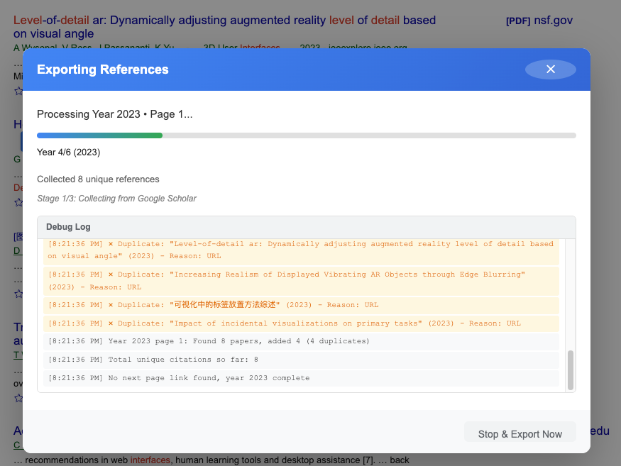
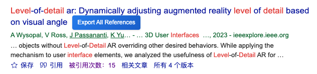

# Scholar Reference Exporter

A Chrome extension that exports all citing papers (references) from Google Scholar with enriched metadata from Semantic Scholar API.

## Features

### Core Functionality
- **One-Click Export**: Hover over any paper title on Google Scholar to reveal the "Export All References" button

- **Year-by-Year Pagination**: Automatically traverses all citing papers from current year back to publication year
- **Smart Deduplication**: Removes duplicates using Scholar ID, URL, and title+year matching
- **Real-time Progress**: Wide progress window with detailed debug log showing every step
- **CSV Export**: Clean, Excel-compatible CSV with full metadata

## Installation

### From Source (Developer Mode)

1. Download or clone this repository
2. Open Chrome and navigate to `chrome://extensions/`
3. Enable **Developer mode** (toggle in top-right corner)
4. Click **Load unpacked**
5. Select the extension folder
6. The extension icon should appear in your toolbar

### From Packed CRX file
1. Download or clone this repository

2. Open Chrome and type chrome://extensions/ in the address bar, then press Enter.

3. In the top-right corner, toggle the "Developer mode" switch to ON.

4. Locate `GScholar-Helper.crx` file in the project.

5. Drag and drop the file directly onto the Extensions page.

6. Click "Add extension" when the confirmation dialog appears.
## Usage
1. Navigate to [Google Scholar](https://scholar.google.com)
2. Search for any topic or paper
3. **Hover** over a paper title in the search results
4. Click the **"Export All References"** button that appears
5. Wait for the export to complete (progress is shown in a modal)
6. The CSV file will be downloaded automatically

## Configuration

Click the extension icon to access settings:

### Basic Settings
- **Max References** (10-5000, default: 1000): Maximum papers to export
- **Auto Sort** (default: ON): Sort results by year (newest first)

### Rate Limiting
- **Per-page Delay** (1-60 seconds, default: 3-8s): Random wait between Scholar page fetches
- **Cooldown** (10-120 seconds, default: 15s): Extended pause after every 5 pages
- **Page Retry Attempts** (0-5, default: 0): Retries for pages that return no results

### Semantic Scholar API
- **Enable/Disable** (default: ON): Toggle metadata enrichment
- **API Key** (optional): Provide API key for faster enrichment
  - **Without key**: 5 req/min (100 req per 5 minutes, free)
  - **With key**: 1 req/sec (60 req/min, requires free signup)
  - Get your key at: https://www.semanticscholar.org/product/api

### Advanced
- **Export Debug Data** (default: OFF): Save failed requests as JSON for debugging

## Exported Data Format

The CSV file includes 7 columns:

| Column | Source | Description |
|--------|--------|-------------|
| Title | Google Scholar | Paper title |
| Authors | Semantic Scholar → Google Scholar | Semicolon-separated author list |
| Venue | Semantic Scholar → Google Scholar | Journal or conference name |
| Year | Google Scholar / Semantic Scholar | Publication year |
| PDF URL | Semantic Scholar | Open access PDF link (if available) |
| Abstract | Semantic Scholar → Google Scholar | Full abstract (500-2000+ chars) or snippet |
| Scholar URL | Google Scholar | Google Scholar page link |

### Filename Format
`PaperName_N_citations_YYYY-MM-DD.csv`
- Example: `Attention_Is_All_You_Need_297_citations_2026-01-03.csv`

## Troubleshooting

### Rate Limiting

**Google Scholar**:
- If you see CAPTCHA, solve it in the new tab that opens
- Extension will resume automatically after verification
- Increase delays if rate limited frequently

**Semantic Scholar**:
- Without API key: 100 requests per 5 minutes
- With API key: Much more reliable, 60 requests per minute
- Automatic retry (up to 2 times) with exponential backoff
- Rate limit counter shown in progress window

### Missing Citations

If exported count < expected count:
- Check debug log for duplicate details (shown in progress window)
- Google Scholar may have duplicates that are filtered out
- Some years may return no results (rate limiting or no papers)
- Enable "Export Debug Data" to analyze failed pages

### Button Doesn't Appear

Try:
- Refreshing the page
- Checking if extension is enabled (`chrome://extensions/`)
- Looking at browser console (F12) for errors

### Incomplete Abstracts

- Enable "Semantic Scholar" in settings
- Abstracts without enrichment are ~200-300 char snippets
- With enrichment, abstracts are 500-2000+ characters
- Coverage best for CS papers (90%+), recent papers (2015+)
- Consider adding API key for more reliable enrichment

## Permissions Required
- `downloads`: To save CSV files to your computer
- `storage`: To persist extension settings
- `host_permissions`:
  - `scholar.google.*`: Access Scholar pages for citation extraction
  - `api.semanticscholar.org`: Enrich metadata via API
